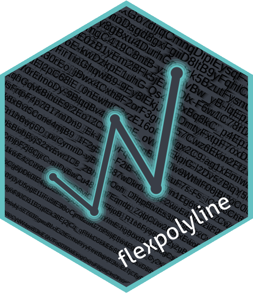

# Flexible Polyline Encoding for R 

<!-- badges: start -->
[](https://CRAN.R-project.org/package=flexpolyline)
[](https://cran.r-project.org/web/checks/check_results_flexpolyline.html)
[](https://CRAN.R-project.org/package=flexpolyline)
[](https://github.com/munterfinger/flexpolyline/actions)
[](https://codecov.io/gh/munterfinger/flexpolyline?branch=master)
[](https://www.codefactor.io/repository/github/munterfinger/flexpolyline)
<!-- badges: end -->

The **flexpolyline** R package provides a binding to the
[C++ implementation](https://github.com/heremaps/flexible-polyline/tree/master/cpp) of the
flexible polyline encoding by [HERE](https://github.com/heremaps/flexible-polyline).
The flexible polyline encoding is a lossy compressed representation of a list of
coordinate pairs or coordinate triples. The encoding is achieved by:
(1) Reducing the decimal digits of each value;
(2) encoding only the offset from the previous point;
(3) using variable length for each coordinate delta; and
(4) using 64 URL-safe characters to display the result.
The flexible polyline encoding is a variant of the [Encoded Polyline Algorithm Format](https://developers.google.com/maps/documentation/utilities/polylinealgorithm) by Google.

**Note:**

* The order of the coordinates (lng, lat) does not correspond to the original C++ implementation (lat, lng). This enables direct conversion to `sf` objects, without reordering the columns.
* The encoding is lossy, this means the encoding process could reduce the precision of your data.

## Installation

Install the released version of **flexpolyline** from [CRAN](https://CRAN.R-project.org/package=flexpolyline):

``` r
install.packages("flexpolyline")
```

Or get the development version from [GitHub](https://github.com/munterfinger/flexpolyline):

``` r
remotes::install_github("munterfinger/flexpolyline@develop")
```

## C++ binding

Encoding and decoding in R is straight forward by using `encode()` and `decode()`.
These functions are binding to the flexpolyline C++ implementation and reflect the arguments and return values of their counterparts (`hf::encode_polyline` and `hf::decode_polyline`):

``` r
line <- matrix(
  c(8.69821, 50.10228, 10,
    8.69567, 50.10201, 20,
    8.69150, 50.10063, 30,
    8.68752, 50.09878, 40),
  ncol = 3, byrow = TRUE
)

encode(line)

decode("BlBoz5xJ67i1BU1B7PUzIhaUxL7YU")
```

## Simple feature support
A common way to deal with spatial data in R is the
[sf](https://CRAN.R-project.org/package=sf) package, which is
built on the concept of simple features. The functions `encode_sf()` and
`decode_sf()` provide an interface that support the encoding of sf objects:

``` r
sfg <- sf::st_linestring(line, dim = "XYZ")

encode_sf(sfg)

decode_sf("BlBoz5xJ67i1BU1B7PUzIhaUxL7YU")
```

## Contributing

* Contributions to this package are very welcome, issues and pull requests are the preferred ways to share them.
* Please see the [Contribution Guidelines](https://github.com/munterfinger/flexpolyline/blob/master/.github/CONTRIBUTING.md) and direct pull requests to the `develop` branch.
* This project is released with a [Contributor Code of Conduct](https://github.com/munterfinger/flexpolyline/blob/master/.github/CODE_OF_CONDUCT.md). By participating in this project you agree to abide by its terms.

## References

* [Flexible Polyline Encoding by HERE](https://github.com/heremaps/flexible-polyline)
* [Encoded Polyline Algorithm Format](https://developers.google.com/maps/documentation/utilities/polylinealgorithm)
* [Simple Features for R](https://CRAN.R-project.org/package=sf)
* Inspired by the [googlePolylines](https://github.com/SymbolixAU/googlePolylines) package

## License

* The **flexpolyline** R package is licensed under GNU GPL v3.0.
* The C++ implementation by HERE Europe B.V. is licensed under MIT.
